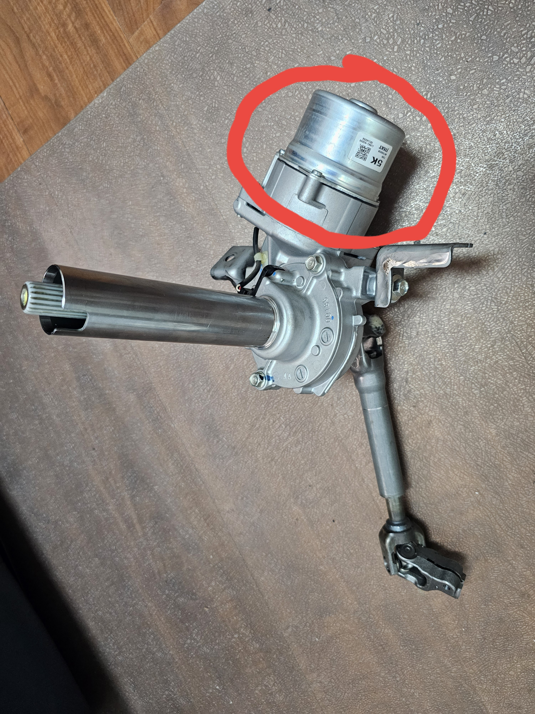
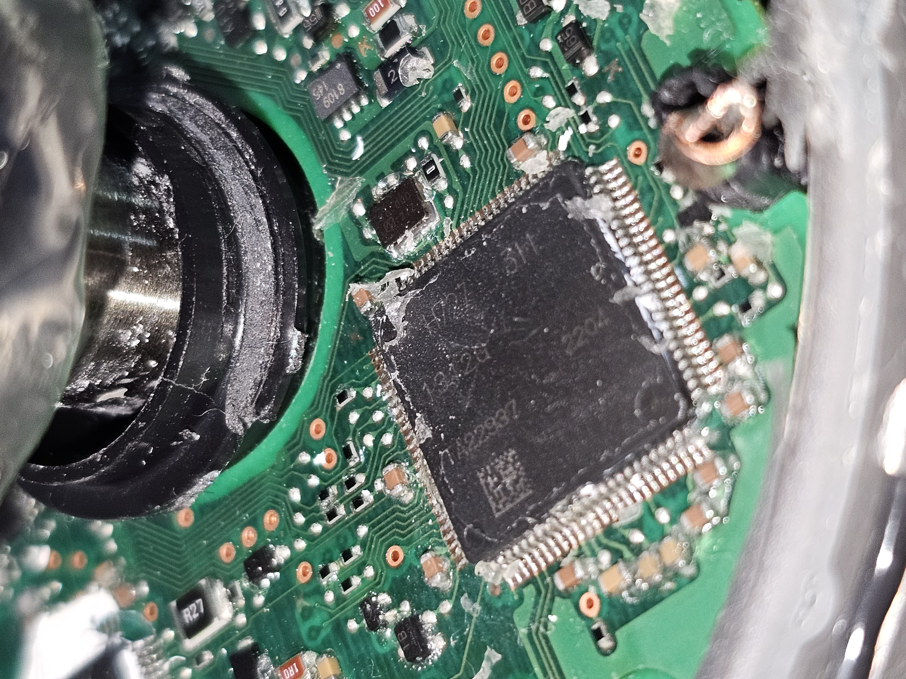
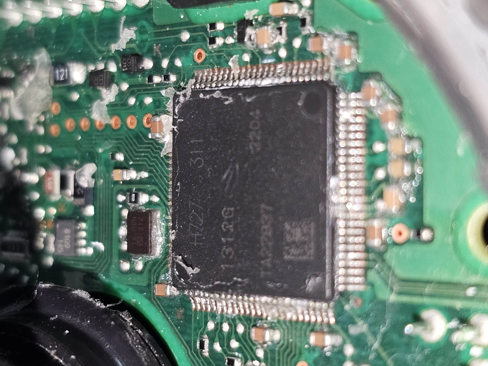
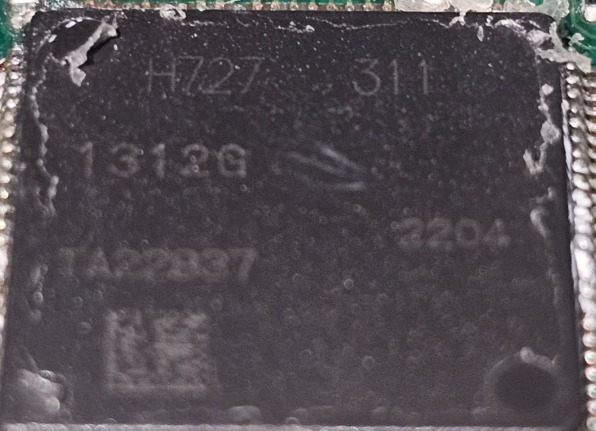

# EPS photographs

All eight supplied photographs are included. Seven came from the photo archive; the eighth was supplied separately. Dates in filenames are retained as supplied.

The publication copies preserve the image content and orientation. GPS and other unnecessary metadata were removed.

The teardown notes identify the main MCU as Renesas R7F701312EAFP / RH850/P1M. Treat the exact part number as a reported identification to verify against these markings, not as a fully legible printed part number. The pictures alone do not establish debug access or pin assignments.

## Column assembly

Complete steering column with the EPS housing circled in the supplied image. The existing red annotation is preserved.

[Open the full-resolution photograph](20260326_112510.jpg)

## MCU and surrounding PCB

Oblique view of the main packaged IC, nearby traces, and exposed marking.

[Open the full-resolution photograph](20260330_145524.jpg)

## MCU marking

Closer view of the main IC and its pins. Useful alongside the separately supplied close-up.

[Open the full-resolution photograph](20260330_145637.jpg)

## Main IC and adjacent circuitry

High-resolution oblique view of the main IC, nearby pads, and components.

[Open the full-resolution photograph](20260330_145720.jpg)

## Other packaged IC and power area

View of another QFP device and surrounding components. Its function is not established by the photograph alone.

[Open the full-resolution photograph](20260330_145725.jpg)

## Manufacturer logo and PCB identifier

Mitsubishi Electric logo and PCB marking near the edge. The research notes transcribe the identifier as JQ331B41G05A.

[Open the full-resolution photograph](20260330_145732.jpg)

## PCB detail

Further view of packaged devices, traces, and the surrounding mechanical assembly.

[Open the full-resolution photograph](20260330_145746.jpg)

## Supplied MCU close-up

Separate reference image supplied with the archive. Exact orderable MCU identification requires interpretation of the markings.

[Open the full-resolution photograph](eps-honda-1.jpeg)
